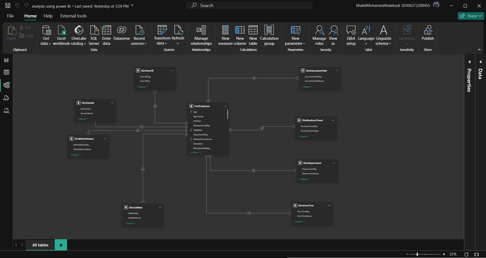

# 🧠 HR Employee Attrition Analysis

## 📋 Project Overview
This project explores key insights into employee attrition across various departments, demographics, and job levels.  
Using **Python**, **SQL Server**, and **Power BI**, I built a full data pipeline — from data cleaning and ETL to dashboard visualization — to uncover trends influencing employee turnover.

---

## ⚙️ Tech Stack & Tools

- 🐍 **Python** → Data cleaning & preprocessing  
- 🧩 **SQL Server** → ETL process (imported data from CSV and structured using SQL)  
- 📊 **Power BI** → Dashboard creation, visual analysis, and storytelling  

---

## 📈 Key Insights

### 🏢 Department-Level
- **Research & Development** had the highest attrition count at **133**,  
  **1,008% higher** than **Human Resources (12)**.  
- **Sales** followed with **92**, while **R&D accounted for 56.12%** of total attrition.

### 👥 Demographics
- **Males aged 31–40** represented **24.05%** of all attrition cases,  
  highlighting a key demographic for retention focus.

### 💰 Performance & Income
- Employees with **Performance Rating 4** earned a slightly higher **average income (6,652)** than rating **3 (6,630)**.  
- In **Human Resources**, high performers earned **450 more** on average.  
- Those who **left the company (Attrition = True)** had an **average income of ~4,000**,  
  suggesting compensation as a possible factor in turnover.

### 📊 Job Level
- **Level 1** had the **highest attrition rate**, over **450% higher** than **Level 4**, which had the lowest.

---

## 📷 Project Preview

### 🔹 Power BI Dashboards
| Dashboard 1 | Dashboard 2 |
|--------------|-------------|
|  |  |

### 🔹 ETL and Schema
| ETL Code 1 | ETL Code 2 | Database Schema |
|-------------|-------------|----------------|
|  |  |  |

---

## 🧩 Workflow Summary
1. **Data Cleaning (Python):**
   - Handled missing values, standardized formats, and encoded categorical variables.
2. **ETL (SQL Server):**
   - Imported CSV files, created relational tables, and performed joins & aggregations.
3. **Visualization (Power BI):**
   - Designed interactive dashboards for HR teams to explore attrition patterns.

---

## 💡 Conclusion
This project highlights how **data-driven insights** can guide HR teams to improve **retention**, **compensation strategies**, and **employee engagement**.  

---

### 📎 Tags
`#DataAnalytics` `#PowerBI` `#Python` `#SQL` `#ETL` `#HRAnalytics` `#AttritionAnalysis` `#BusinessIntelligence` `#DataVisualization`

